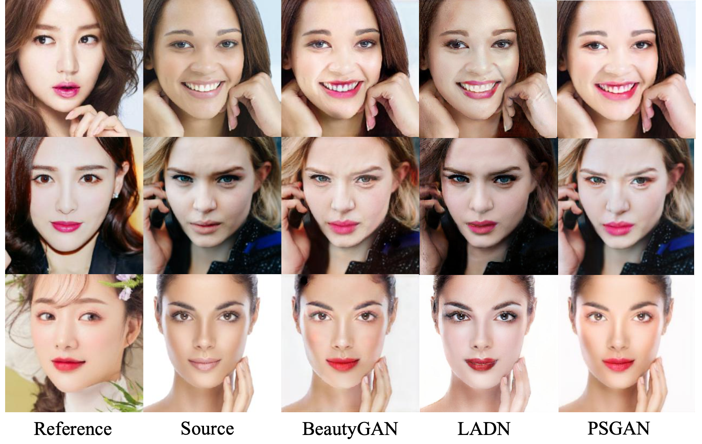
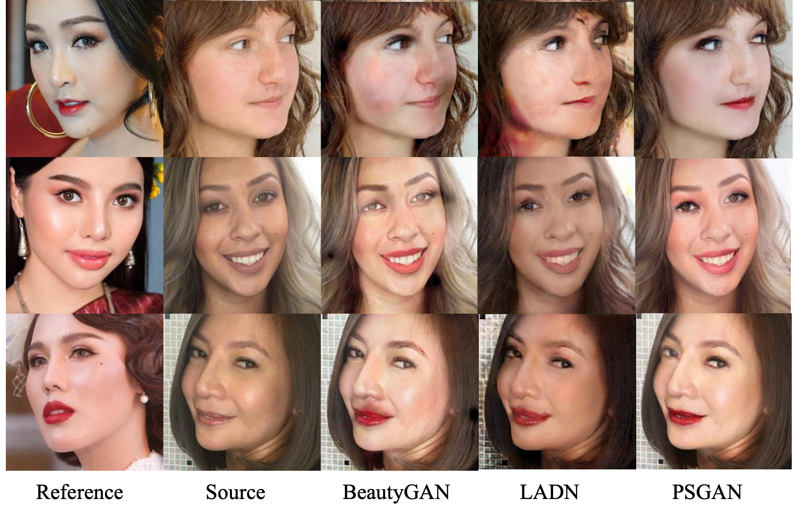
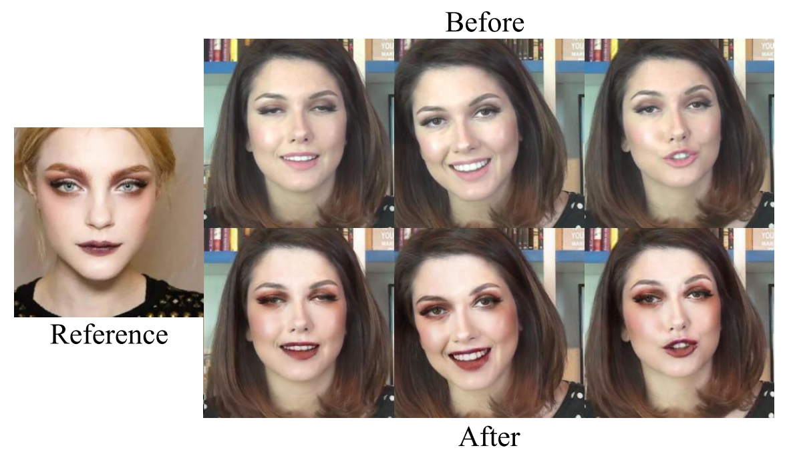

# PSGAN

Code for our CVPR 2020 **oral** paper "[PSGAN: Pose and Expression Robust Spatial-Aware GAN for Customizable Makeup Transfer](https://arxiv.org/abs/1909.06956)".

Contributed by [Wentao Jiang](https://wtjiang98.github.io), [Si Liu](http://colalab.org/people), Chen Gao, Jie Cao, Ran He, [Jiashi Feng](https://sites.google.com/site/jshfeng/), [Shuicheng Yan](https://www.ece.nus.edu.sg/stfpage/eleyans/).

This code was further modified by [Zhaoyi Wan](https://www.wanzy.me).

In addition to the original algorithm, we added high-resolution face support using Laplace tranformation.


## Checklist
- [x] more results 
- [ ] video demos
- [ ] partial makeup transfer example
- [ ] interpolated makeup transfer example
- [x] inference on GPU
- [x] training code


## Requirements

The code was tested on Ubuntu 16.04, with Python 3.6 and PyTorch 1.5.

For face parsing and landmark detection, we use dlib for fast implementation.

If you are using gpu for inference, *do* make sure you have gpu support for dlib.


## Test

Run `python3 demo.py` or `python3 demo.py --device cuda` for gpu inference.


## Train
1. Download training data from [link](https://drive.google.com/drive/folders/1ubqJ49ev16NbgJjjTt-Q75mNzvZ7sEEn?usp=sharing), and move it to sub directory named with "data". (For BaiduYun users, you can download the data [here](https://pan.baidu.com/s/1ZF-DN9PvbBteOSfQodWnyw). Password: rtdd)


Your data directory should be looked like:

```
data
├── images
│   ├── makeup
│   └── non-makeup
├── landmarks
│   ├── makeup
│   └── non-makeup
├── makeup.txt
├── non-makeup.txt
├── segs
│   ├── makeup
│   └── non-makeup
```

2. `python3 train.py`

Detailed configurations can be located and modified in configs/base.yaml, where
command-line modification is also supportted.

*Note: * Although multi-GPU training is currently supported, due to the limitation of pytorch data parallel and gpu cost, the numer of
adopted gpus and batch size are supposed to be the same.

## More Results

#### MT-Dataset (frontal face images with neutral expression)




#### MWild-Dataset (images with different poses and expressions)



#### Video Makeup Transfer (by simply applying PSGAN on each frame)



## Citation
Please consider citing this project in your publications if it helps your research. The following is a BibTeX reference. The BibTeX entry requires the url LaTeX package.

~~~
@InProceedings{Jiang_2020_CVPR,
  author = {Jiang, Wentao and Liu, Si and Gao, Chen and Cao, Jie and He, Ran and Feng, Jiashi and Yan, Shuicheng},
  title = {PSGAN: Pose and Expression Robust Spatial-Aware GAN for Customizable Makeup Transfer},
  booktitle = {IEEE/CVF Conference on Computer Vision and Pattern Recognition (CVPR)},
  month = {June},
  year = {2020}
}
~~~

## Acknowledge
Some of the codes are built upon [face-parsing.PyTorch](https://github.com/zllrunning/face-parsing.PyTorch) and [BeautyGAN](https://github.com/wtjiang98/BeautyGAN_pytorch). 

You are encouraged to submit issues and contribute pull requests.
